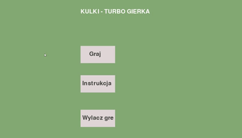

# Kulki

1. Podstawowe zasady:

-Dwóch graczy (pierwszy: sterowanie WASD, kopnięcie na klawisz V; drugi: sterowanie strzałkami, kopnięcie na klawisz RCTRL

-„Piłka jest jedna a bramki są dwie”

-Limit czasowy gry wynosi 90 sekund (jeśli uznam, że jest to za mało zmienię na więcej)

-Wygrywa zawodnik, który zdobędzie więcej goli

2. Mechanika gry:

- Zamiast „outów” piłka odbija się o bandy oraz słupki

-Kulki (zarówno zawodnicy oraz piłka) nie mogą nachodzić na siebie

-Tryb kopnięcia (Jeżeli zawodnik jest w pobliżu piłki to kopnij ją)

-Klawisz kopnięcia można trzymać cały czas (powoduje to jednak zmniejszenie prędkości zawodnika)

-Gdy zawodnik kopnie piłkę, tryb kopania natychmiast dezaktywuje się (w celu uniknięcia sytuacji w której oboje z zawodników kopią piłkę w siebie nawzajem „z automatu”)

-Kulki obowiązywać będzie zasada zachowania energii (jeżeli zawodnik X kopnie piłką w zawodnika Y, to zawodnik Y zostanie odepchnięty

3. Efekty wizualne:

-U góry ekranu widoczny jest wynik spotkania oraz czas

-Animacja kopnięcia (coś w stylu wyświetlenia kolorowego pierścienia wokół zawodnika

# SPRAWOZDANIE 1 (2.04.2020)

Co zostało wykonane dotychczas:
1.	Inicjalizacja okna gry, ustawienia wymiarów boiska
2.	Klasy obiektów (gracz, piłka, słupki)- każda klasa przypisuje obiektom wartości takie jak: pozycja (układ XY z wykorzystaniem wektora z biblioteki NumPy) indeks, prędkość, kolor, oraz wartości fizyczne, które przydadzą się w przyszłości. Klasy posiadają również metody do rysowania obiektów, resetowania ich pozycji, (w przypadku gracza)  obliczania dystansu od drugiego obiektu oraz kierunku kopnięcia piłki).
3.	Sterowanie dwoma graczami (gracz przyspiesza, nie ma od razu prędkości maksymalnej)
4.	Wyświetlanie wyniku oraz czasu gry.
5.	Tłumienie prędkości obiektów (prędkość piłki po kopnięciu jej ulega zmniejszeniu; prędkość gracza po puszczeniu klawisza sterowania ulega zmniejszeniu).
6.	Prędkość gracza trzymającego klawisz kopnięcia jest mniejsza.
7.	Gracze nie mogą wyjść poza okno gry.
8.	Piłka nie może wyjść poza boisko.

Co zostało do zrobienia:
1.	Blokada nachodzenia na siebie obiektów.
2.	Wprowadzenie zasady zachowania energii.
3.	Ustawienie limitu czasowego gry.
4.	…

# SPRAWOZDANIE 2 (30.04.2020)

Co zostało dodane:
1.	Blokada nachodzenia na siebie obiektów.
2.	Wprowadzenie zasady zachowania energii.
3.	Ustawienie limitu czasowego gry.

# SPRAWOZDANIE 3 (22.05.2020)
Co zostało dodane:
1. Menu gry
2. Zakładka instrukcje
3. Przycisk zakończenia gry

# Wersja alpha (29.05.2020)
Co zostało dodane:
1. Freeze graczy oraz piłki po upłynięciu czasu gry
2. Gra została przeniesiona do pliku exe.

